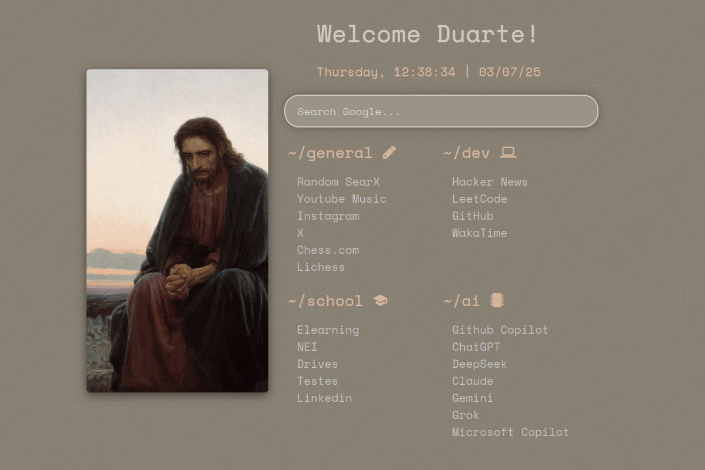

# Duarte's Startpage

This page is my fork from [here](https://github.com/fxzzi/startpage).

It uses the colors from `colors.css`, which is the file generated by [pywal](https://github.com/eylles/pywal16), and it uses the wallpaper that was used to generate the colors.

Every time you rerun `pywal`, you must run `update-startpage.sh` so that `colors.css` and the wallpaper are reloaded accordingly.

I also made a search box who redirects to Google.

Clone it, fork it, change it and do whatever you want with this project.

## Examples

